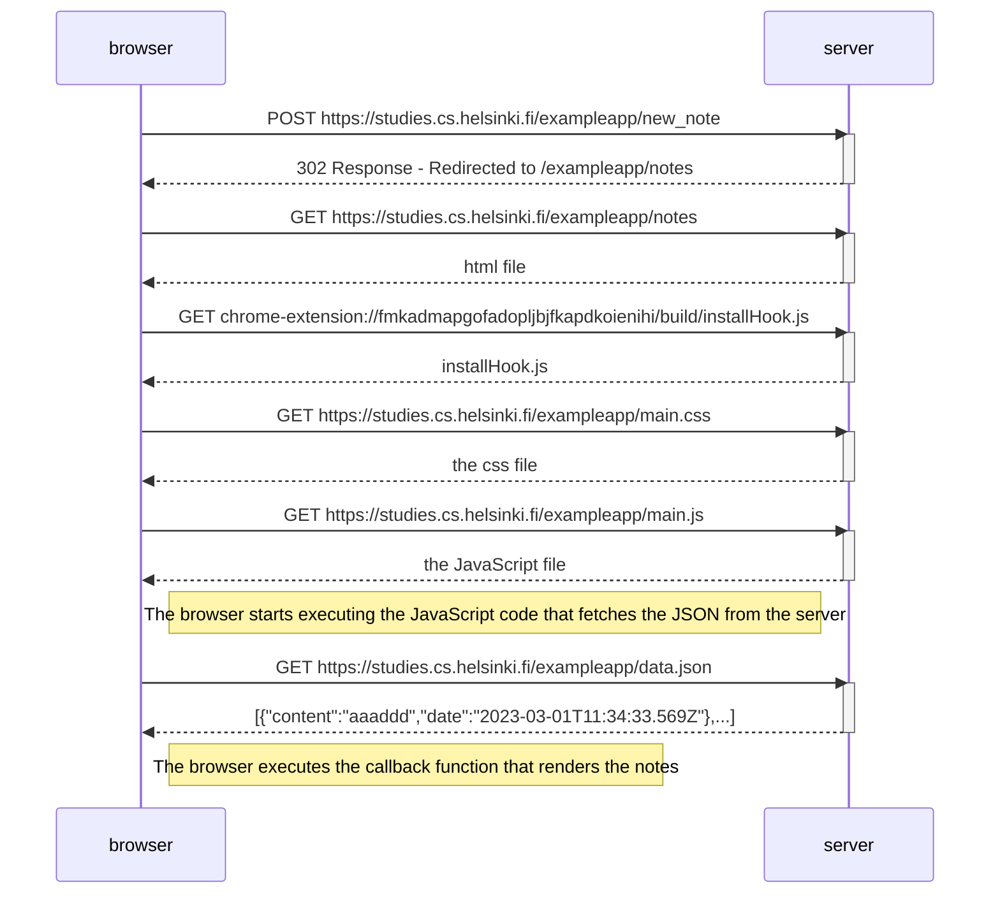

```mermaid
sequenceDiagram
    participant browser
    participant server
    
    browser->>server: POST https://studies.cs.helsinki.fi/exampleapp/new_note
    activate server
    server-->>browser: 302 Response - Redirected to /exampleapp/notes 
    deactivate server
    
    browser->>server: GET https://studies.cs.helsinki.fi/exampleapp/notes
    activate server
    server-->>browser: html file
    deactivate server
    
    browser->>server: GET chrome-extension://fmkadmapgofadopljbjfkapdkoienihi/build/installHook.js
    activate server
    server-->>browser: installHook.js
    deactivate server
    
    browser->>server: GET https://studies.cs.helsinki.fi/exampleapp/main.css
    activate server
    server-->>browser: the css file
    deactivate server
    
    browser->>server: GET https://studies.cs.helsinki.fi/exampleapp/main.js
    activate server
    server-->>browser: the JavaScript file
    deactivate server
    
    Note right of browser: The browser starts executing the JavaScript code that fetches the JSON from the server
    
    browser->>server: GET https://studies.cs.helsinki.fi/exampleapp/data.json
    activate server
    server-->>browser: [{"content":"aaaddd","date":"2023-03-01T11:34:33.569Z"},...]
    deactivate server

    Note right of browser: The browser executes the callback function that renders the notes
```
