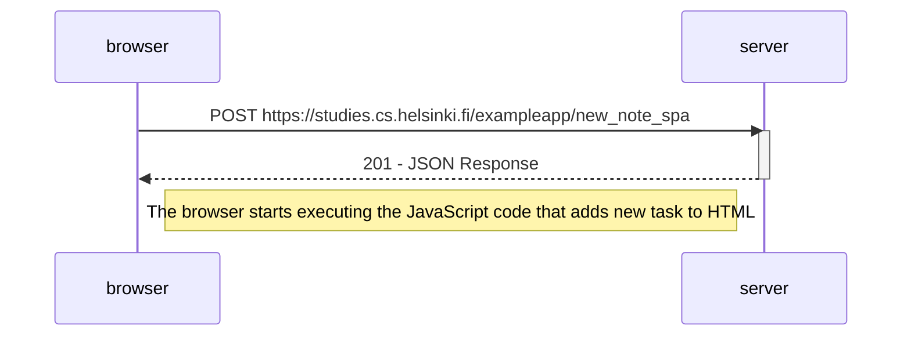

```mermaid
sequenceDiagram
    participant browser
    participant server
    
    browser->>server: POST https://studies.cs.helsinki.fi/exampleapp/new_note_spa
    activate server
    server-->>browser: 201 - JSON Response
    deactivate server
   
    Note right of browser: The browser starts executing the JavaScript code that adds new task to HTML
   
   
```
